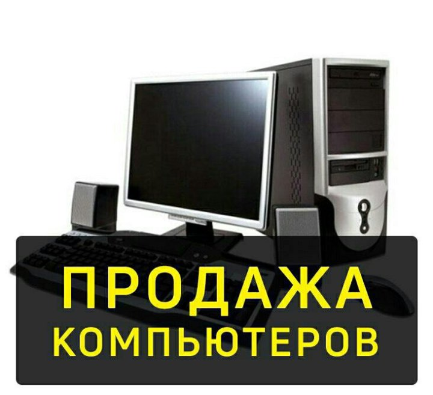
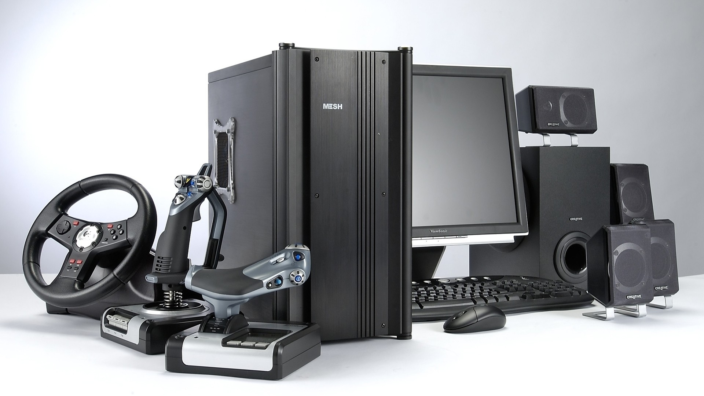
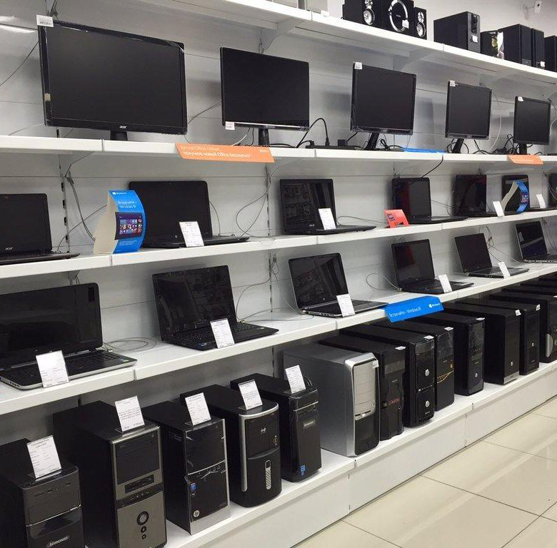

# torrgkui.github.io
<!DOCTYPE html>
<html lang="ru" >
<head>
<meta charset="UTF-8">
<title>Магазины компьютерной техники в Уфе</title>

</head>
<body>
<header class="header">
<a class="logo">
Магазин компьютерной техники в Уфе
</a>

</header>
<main class="main">

<h1>Магазин</h1>

Мы работаем с 1996 года и являемся одним из крупнейших интернет-магазинов на территории Российской Федерации. Штат сотрудников состоит из нескольких сотен специалистов, а каталог – уже давно превысил 70 000 товарных позиций.

Напрямую сотрудничаем с известными производителями, используем отработанные схемы доставки, разработали программу лояльности для покупателей.

Мы продолжаем активно развиваться и стремимся быть максимально полезными и удобными для наших клиентов!

<h1>О компании</h1>

ООО «Компания РБТ» занимается оптовой закупкой и продажей бытовых электро-, теле-, радиотоваров и услуг, владеет торговым знаком, доменным именем и сайтом «www.RBT.ru», клубной системой «Клуб RBT.ru». ООО «Компания РБТ» имеет развитую сеть франчайзинга из 67 лиц на 1 мая 2023 г., при котором Франчайзи приобрели по соответствующему договору право на открытие бизнеса под торговым знаком «www.RBT.ru».

Между ООО «Компания РБТ» и Франчайзи заключен договор в соответствии с которым ООО «Компания РБТ» размещает на сайте «www.RBT.ru» информацию о Франчайзи: как о продавце товаров и услуг; о магазинах и их адресах, в которых Франчайзи реализует товары и услуги; о товарах с их описанием, техническими характеристиками, ценой и услугах Франчайзи; о проводимых рекламных акциях их организаторе, порядке, правилах и сроках проведения; об участии Франчайзи в Клубной системе «Клуб RBT.ru»

<h1> Реквизиты</h1>

ООО "Компания РБТ"

Юридический адрес: 454008, Челябинская область, г. Челябинск, ул. Производственная д. 8 б, офис 303

ОГРН: 1027403771680

ИНН: 7452030451

Номер телефона: 8-800-600-3900 

<h1>Широкий ассортимент</h1>

По масштабам каталога мы уже сменили статус магазина на статус гипермаркета. К вашим услугам более 20 товарных категорий, включающих в себя десятки тысяч товаров. Мы не ограничиваемся одним направлением, а готовы предложить товары практически для любых сфер: компьютеры и комплектующие, расходные материалы для техники, ведение бизнеса (работа с B2B), строительство, ремонт, садовые работы и многое другое.

<h1 class="comment-title">Низкие цены</h1>

Здесь все просто: мы слишком давно на рынке и не пользуемся  услугами посредников. Это дает нам возможность не включать в стоимость товара затраты на их услуги. Только прямое сотрудничество с производителями, только адекватные цены без фантастических «накруток». 

<h1 class="comment-title">Гарантия</h1>

Подавляющее большинство товаров сопровождаются гарантией производителя. Если наступит гарантийный случай, то мы в ускоренном режиме произведем процедуру возврата/обмена товара, потратив на это не более 14 дней с момента обращения.
 

</main>

</body>
</html>
